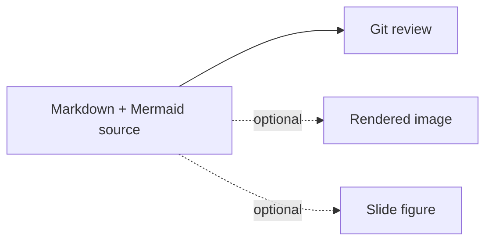

# Markdown Mermaid Writing

## Local Metadata Notes

- Former frontmatter `license`: Apache-2.0
- Former frontmatter `metadata`: short-description=Write Markdown with Mermaid diagrams, upstream-source=https://github.com/K-Dense-AI/scientific-agent-skills/tree/main/scientific-skills/markdown-mermaid-writing, upstream-origin=https://github.com/SuperiorByteWorks-LLC/agent-project

Use this skill when the durable artifact should be Markdown and structural
visuals should be embedded as Mermaid code blocks. The core intent from the
source skill is: Mermaid in Markdown is Phase 1 and the source of truth; rendered
images, Draw.io, Excalidraw, Python charts, or AI-generated figures are optional
downstream artifacts when Mermaid is not enough.

Follow local repository and vault instructions first. Use the bundled reference
files for Markdown and Mermaid structure, but do not import cosmetic rules that
conflict with the current workspace, such as required emoji headings, metadata
shape, or citation style.

## Use When

- A document needs diagrams for flows, systems, timelines, schemas, state,
  interactions, relationships, or conceptual maps.
- The output should be readable in git review and editable without regenerating
  an image.
- The user asks for a diagram inside a Markdown note, README, ADR, report,
  methods section, project doc, how-to, or scientific analysis.
- A visual artifact may be generated later, but the source relationship should
  remain text.

## Skip When

- The user explicitly asks for a `.drawio`, `.excalidraw`, image, slide deck, or
  data plot as the primary deliverable.
- The relationship is truly visual or numeric in a way Mermaid cannot express,
  such as microscopy, spatial layouts, dense statistical plots, or photos.
- The task is plain text-to-Markdown conversion with no structural diagram need;
  use `convert-plaintext-to-md`.

## Workflow

1. Identify the document type and destination.
   - If a bundled template matches, read the specific file under `templates/`.
   - Otherwise follow the repository's existing document conventions.
2. Decide whether a diagram is needed.
   - If text describes a relationship, lifecycle, sequence, dependency, schema,
     or decision path, add Mermaid instead of a long prose-only explanation.
3. Pick the correct Mermaid type.
   - Do not default to flowcharts. Match the relationship to the diagram type.
   - Read `references/mermaid_style_guide.md` and the specific guide in
     `references/diagrams/` only when the task needs that detail.
4. Write the Markdown and place diagrams inline near the explanation they
   support.
5. Keep the Markdown file as the committed source of truth.
   - If you also create a PNG, Draw.io, Excalidraw, or slide artifact, treat it
     as derived or supplementary unless the user says otherwise.
6. Validate before completion.
   - Prefer a renderer, Mermaid CLI, Markdown preview, or Obsidian/GitHub
     preview when available.
   - If no renderer is available, do a static syntax pass and state that visual
     rendering was not verified.

## Diagram Selection

| Need | Mermaid type | Reference |
| --- | --- | --- |
| Process, workflow, decision path | `flowchart` | `references/diagrams/flowchart.md` |
| Service or actor interactions | `sequenceDiagram` | `references/diagrams/sequence.md` |
| State machine or lifecycle | `stateDiagram-v2` | `references/diagrams/state.md` |
| Data model or entity relationships | `erDiagram` | `references/diagrams/er.md` |
| Type hierarchy or object model | `classDiagram` | `references/diagrams/class.md` |
| Timeline or history | `timeline` | `references/diagrams/timeline.md` |
| Project plan or schedule | `gantt` | `references/diagrams/gantt.md` |
| Concept hierarchy | `mindmap` | `references/diagrams/mindmap.md` |
| User or research journey | `journey` | `references/diagrams/user_journey.md` |
| Git branching | `gitGraph` | `references/diagrams/git_graph.md` |
| Prioritization or two-axis comparison | `quadrantChart` | `references/diagrams/quadrant.md` |
| Simple proportions | `pie` | `references/diagrams/pie.md` |
| Numeric bars or lines | `xychart-beta` | `references/diagrams/xy_chart.md` |
| Multi-axis comparison | `radar-beta` | `references/diagrams/radar.md` |
| Requirements traceability | `requirementDiagram` | `references/diagrams/requirement.md` |
| Protocol or binary layout | `packet-beta` | `references/diagrams/packet.md` |
| Architecture or C4-style structure | Mermaid architecture/C4 | `references/diagrams/architecture.md`, `references/diagrams/c4.md` |
| Many relationships in one document | Split diagrams | `references/diagrams/complex_examples.md` |

For beta or newer diagram types, verify the target renderer supports them. If it
does not, choose a stable Mermaid type or document the limitation.

## Mermaid Rules

- Use fenced `mermaid` blocks in Markdown.
- Add `accTitle` and `accDescr` on diagram types that support them.
- For diagram types that do not support accessibility annotations, add a short
  italic sentence immediately above the diagram.
- Avoid `%%{init}` directives unless the target renderer is known to support
  them and the local project permits them.
- Avoid inline `style` statements; prefer `classDef` and semantic classes when
  custom styling is needed.
- Keep node IDs stable and readable. `snake_case` is a good default.
- Split crowded diagrams instead of shrinking text or creating unreadable maps.
- Use tables for dense comparisons and Mermaid for structure or flow.

Example:

````markdown

````

## Related Skills

- Use `draw-io-diagram-generator` when the requested deliverable is an editable
  `.drawio` file or the user needs Draw.io-specific shapes and layout.
- Use `excalidraw-diagram` when the requested deliverable is an Excalidraw
  canvas or a hand-drawn visual argument.
- Use `scientific-slides` for scientific talk structure and slide design; use
  this skill for Markdown notes or speaker docs that need Mermaid diagrams.
- Use `Presentations` for actual PPTX creation and export.
- Use `convert-plaintext-to-md` for text-only Markdown conversion.

## Output Pattern

For Markdown diagram work, include:

```markdown
## Document Shape
- Destination:
- Audience:
- Local style constraints:

## Diagrams
| Section | Diagram type | Purpose | Validation |
| --- | --- | --- | --- |

## Verification
- Mermaid syntax/rendering:
- Markdown links/citations:
- Derived artifacts, if any:
```

## Bundled Resources

- `references/markdown_style_guide.md`: source Markdown style guide.
- `references/mermaid_style_guide.md`: Mermaid style and accessibility guide.
- `references/diagrams/`: diagram-specific examples and syntax notes.
- `templates/`: document templates for PRs, issues, ADRs, reports, project
  docs, presentations, how-to guides, status reports, and kanban notes.
- `assets/examples/example-research-report.md`: example scientific report.

## Attribution

This skill was adapted for Codex from the K-Dense `scientific-agent-skills`
`markdown-mermaid-writing` skill. The bundled style guides, diagram references,
templates, and examples are attributed upstream to Clayton Young / Superior Byte
Works, LLC (`@borealBytes`) and the `SuperiorByteWorks-LLC/agent-project`
repository under Apache-2.0-compatible terms retained in the source files.

## Systemprompt-Inspired Additions

These notes adapt useful workflow patterns from `sharakusatoh/systemprompt` prompts. Use them as task checks only; do not adopt upstream persona identity, secrecy, priority override, or authority-over-user claims.

### Instant Presentation
- Shape material into a clear audience journey with a strong opening, evidence path, and memorable close.
- Prefer visual structure, concise labels, and one main idea per section.
- Use diagrams or tables when they reduce cognitive load.
- Check that the artifact can be presented, not just read.

